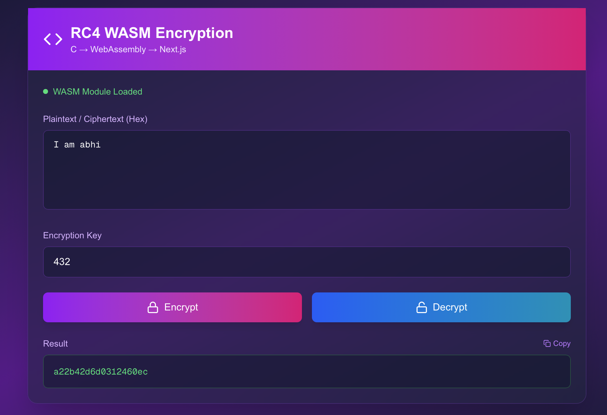

# Assignment 4 – Next.js + Tailwind Project

## 📌 Overview

This project is a **Next.js 16** web application styled with **TailwindCSS 4**, deployed using Netlify. It also includes an additional C program (`rc4.c`) used for cryptographic experimentation.

---

## ✨ Features

* ⚡ Built with **Next.js 16** and **React 19**
* 🎨 Styled using **TailwindCSS v4**
* 🚀 Ready for **Netlify deployment** (`netlify.toml` included)
* 🧩 Component-driven structure (`src/` folder)
* 🔐 Includes **RC4 encryption implementation in C**

---

## 📂 Project Structure

```
assignment4/
│── src/              # Main Next.js source code
│── public/           # Public assets
│── rc4.c             # RC4 encryption C program
│── package.json      # Project configuration
│── jsconfig.json     # Path aliasing
│── tailwind config   # postcss.config.mjs, eslint.config.mjs
│── next.config.mjs   # Next.js configuration
│── netlify.toml      # Deployment config
│── build.sh          # Build script
│── .next/            # Auto-generated Next.js build directory
```

---

## 🛠️ Installation

### 1. Clone Repository

```
git clone <repo-link>
cd assignment4
```

### 2. Install Dependencies

```
npm install
```

---

## ▶️ Running the Project

### Development Mode

```
npm run dev
```

Runs on: `http://localhost:3000`

### Production Build

```
npm run build
npm start
```

---

## 📡 Deployment (Netlify)

Deployment is completely automated via **netlify.toml**.

To deploy:

1. Push to GitHub
2. Login to Netlify
3. Select "Import existing project"
4. Build command:

```
npm run build
```

5. Publish directory:

```
.next
```

---

## 📸 Screenshots

*Add screenshots like:*

```

```

---

## 🔐 RC4 Encryption (C Program)

The project includes a file `rc4.c` implementing the **RC4 stream cipher**.

### Compile

```
gcc rc4.c -o rc4
```

### Run

```
./rc4
```

---

## 🧪 Testing

This project does not include formal tests, but you can run linting:

```
npm run lint
```

---

## 📄 License

This project includes an MIT license file.

---

## 🙌 Acknowledgements

* Next.js & Vercel team
* TailwindCSS
* React contributors
